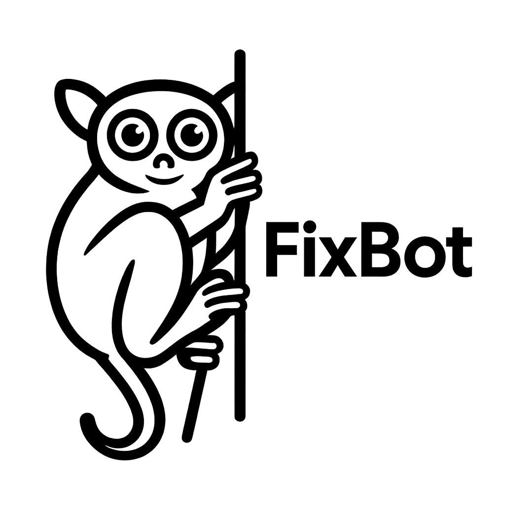

<div align="center">


# FixBot 2025

<p>
  <strong>AI-Powered Development Assistant for Seamless Code Fixes & Optimization</strong>
</p>

<p>
  <a href="#-features">Features</a> •
  <a href="#-quick-start">Quick Start</a> •
  <a href="#-tech-stack">Tech Stack</a> •
  <a href="#-demo">Demo</a> •
  <a href="#-team">Team</a>
</p>

</div>

---

<p align="center">
  <a href="https://github.com/Fission-AI/OpenSpec">
    
    
  </a>
  
</p>
<p align="center">Spec-driven development for AI coding assistants.</p>
<p align="center">
  <a href="https://github.com/Fission-AI/OpenSpec/actions/workflows/ci.yml"></a>
  <a href="https://www.npmjs.com/package/@fission-ai/openspec"></a>
  <a href="https://nodejs.org/"></a>
  <a href="./LICENSE"></a>
  <a href="https://conventionalcommits.org"></a>
  <a href="https://discord.gg/YctCnvvshC"></a>
</p>

---

## About FixBot

FixBot is an AI coding assistant designed to accelerate the development process with automatic bug detection, code improvement suggestions, and performance optimization. Built with the latest AI technology, FixBot helps developers solve coding problems faster and more efficiently.

---

## Features

### Intelligent Code Analysis

- Real-time bug detection dan error highlighting
- Context-aware suggestions berdasarkan codebase Anda
- Multi-language support (JavaScript, TypeScript, Python, Java, dll)

### Auto-Fix Capabilities

- One-click fix untuk common issues
- Batch fixing untuk multiple files
- Safe refactoring dengan preview changes

### Code Quality Dashboard

- Metrics dan analytics untuk code health
- Historical tracking untuk improvements
- Team collaboration features

### AI-Powered Assistant

- Natural language queries untuk code questions
- Documentation generation otomatis
- Code explanation untuk better understanding

---

## Demo

<div align="center">
  
  
  *[Link to demo video]*
</div>

### Try it yourself:

```bash
# Coming soon!
npx fixbot@latest
```

---

## Quick Start

### Prerequisites

- Node.js 18+
- npm / yarn / pnpm
- Git

### Installation

```bash
# Clone repository
git clone https://github.com/YourUsername/FixBot_2025.git
cd FixBot_2025

# Install dependencies
npm install

# Setup environment variables
cp .env.example .env
# Edit .env dengan API keys Anda

# Run development server
npm run dev
```

### Project Structure

```
FixBot_2025/
├── packages/
│   ├── app/           # Frontend application
│   ├── api/           # Backend API
│   └── shared/        # Shared utilities
├── docs/              # Documentation
├── scripts/           # Build scripts
└── tests/             # Test suites
```

---

## 📖 Documentation

Untuk dokumentasi lengkap, kunjungi [docs folder](./docs) atau [Wiki](https://github.com/YourUsername/FixBot_2025/wiki).

- [Getting Started Guide](./docs/getting-started.md)
- [API Documentation](./docs/api.md)
- [Contributing Guidelines](./CONTRIBUTING.md)
- [Architecture Overview](./docs/architecture.md)

---

## Roadmap

- [x] Core AI integration
- [x] Basic bug detection
- [x] Web dashboard
- [ ] VS Code extension
- [ ] GitHub integration
- [ ] Multi-language support expansion
- [ ] Team collaboration features
- [ ] Enterprise features

---

## Team

<table>
  <tr>
    <td align="center">
      <a href="https://github.com/fdhliakbar">
        
        <br />
        <sub><b>Muhamad Fadhli Akbar</b></sub>
      </a>
      <br />
      <sub>Full Stack Developer</sub>
    </td>
    <td align="center">
      <a href="https://github.com/andinirifaat">
        
        <br />
        <sub><b>Andini Nareswari</b></sub>
      </a>
      <br />
      <sub>System Design</sub>
    </td>
  </tr>
</table>

---

## Contributing

Kami sangat terbuka untuk kontribusi! Silakan baca [CONTRIBUTING.md](./CONTRIBUTING.md) untuk detail proses development dan cara submit pull requests.
